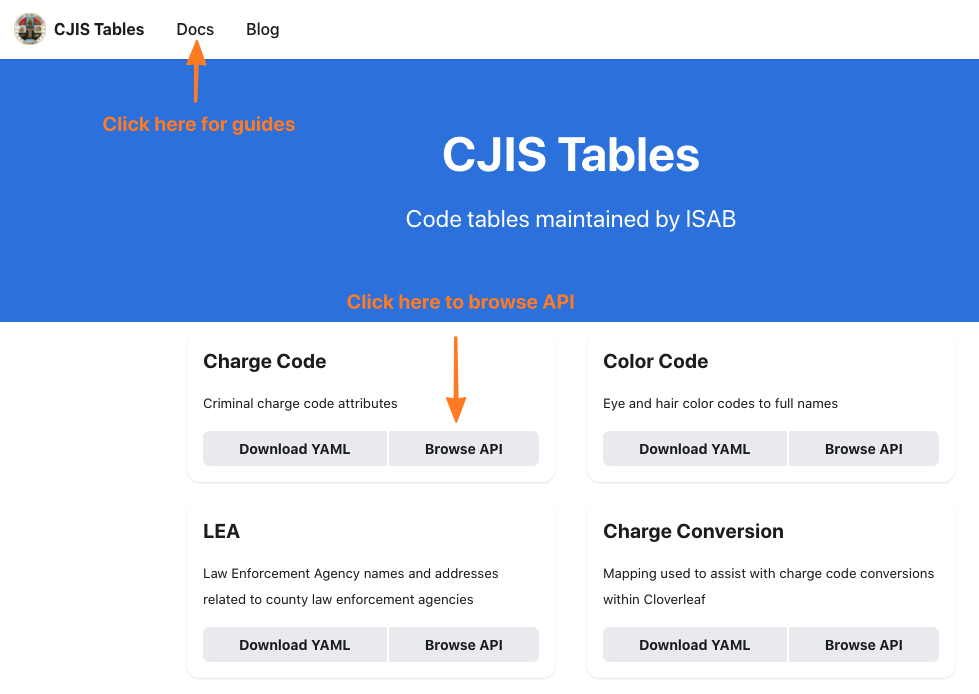

# CJIS Tables SDK

This repository provides client API guidance for the
[CJIS Tables API](https://docs.codes.lacounty-isab.org).

## Contents

* [.Net Client](dotnet)
* [Node.js Client](nodejs)
* [Sample Keys](keys)

## Official Documentation

The OpenAPI 3.0 specification for **CJIS Tables** resides at

https://docs.codes.lacounty-isab.org



Click the **Docs** link for general guidance.  This guide
*supplements* the official documentation with .Net-specific
examples.  It's not a standalone substitute for reading the
API documenation.

## This Documentation

The page covers SDK details that pertain to all the platforms.
After you read this section, navigate to the directory for your
platform.  It will contain instructions specific to the runtime.

## Prerequisites

For code samples that invoke an API, set the value of your APK key
to the `APIKEY` environment variable.

Linux and macOS:
```
export APIKEY=<your api key here>
```

Windows:
```
set APIKEY=<your api key here>
```

## Key Generation

See the [Key Generation Section](keys/readme.md) for the available
sample keys and how to generate your own keys.  If you do opt to
generate your own keys (recommended), be sure to update the filenames
used by the sample code for your platform.
Filenames used by the sample code are defined near the top of each
file so they may be easily modified.

## JWT Generation

Each runtime in the SDK will provide a standalone JWT generation sample
using the RSA and HMAC keys provided in the [keys](keys) directory.

## Updates

To authenticate a request for an update, you need to provide a JWT
signed by a registered issuer.  There are two ways to have your JWT
issued by a registered issuer.

1. Host your own IDP.  This is what most system-to-system calls do.
   For this to work, you must have your IDP registered with the
   API application.

2. Use an existing issuer such as `cjisidp` hosted by the CJIS Tables
   authentication server.  This is what the Web UI does.  But it,
   in turn, requires that 
   
   1. the user of your software trusts you with their password
   2. the `cjisidp` IDP hosts the user account


### System to System

**Note:** Authentication is unnecessary if your system merely reads
from CJIS tables.

Most system-to-system clients are also registered IDPs.  To register
your system as an IDP you follow these steps.

1. Decide on an issuer name for your system/idp.  In the JWT samples,
   the string `myidp` is used for the issuer name.

2. Generate an RSA or HMAC key.

3. Send your issuer name and key to a CJIS Tables admin through
   encrypted email.

4. Schedule a meeting with CJIS admins to discuss the scopes that your
   issuer will be allowed to assert.

### Using CJISIDP

This is common for a web UI which runs in a user's browser.  The
web UI provides an entry field for the user ID and password.  It
then POSTs these to the authentication server.  If the user ID and
password match, then a JWT is returned with scopes from the user's
profile.

The CJISIDP manages a limited number of users.  If you wish to
register a significant number of users from your agency, consider
managing your own IDP and user registration.  Your agency's IDP
will be registered with the application to trust the appropriate
scopes.